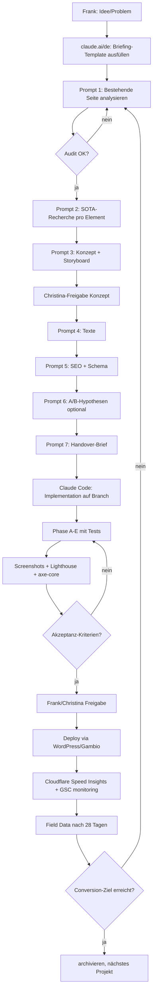

# Landing-Page-SOTA 2026 — Prompt-Pack + Unterstützungsprozess

**Stand:** 16. Mai 2026 · **Für:** Sound-Spirit + verwandte Klangschalen/Wellness-Sites
**Ziel:** Frank/Christina sollen ohne Prompt-Engineering-Vorkenntnisse moderne, conversions-starke Pages bauen können — via claude.ai/de (Konzept) → Claude Code (Implementation).

---

## TL;DR — Was sich 2026 grundlegend geändert hat

| Was | Vorher | Jetzt (Mai 2026) | Konsequenz |
|---|---|---|---|
| **Google FAQ Rich Results** | seit 2019 als Snippet in SERP | **abgeschafft am 7. Mai 2026** | FAQPage-Schema bleibt drin, aber das Ziel hat sich verschoben |
| **FAQPage-Schema** | nice-to-have | **3,2× wahrscheinlicher in AI Overviews zitiert** | wichtiger denn je, anderer Sinn |
| **Google AI Overviews** | 5 % SERPs | **31 % SERPs** | wer dort nicht zitiert wird, verliert Traffic |
| **Performance-Ranking** | Lab-Daten (Lighthouse) | **Field-Daten (CrUX/RUM)** | echte User-Werte zählen, nicht Score 100 im Test |
| **Mobile-Conversion-Gap** | bekannt | **40-51 % schlechter als Desktop** | Mobile-First ist nicht mehr optional |
| **Page-Speed-Hebel** | nice | **1 s → 5 s = −60 % Conversion** | jede zusätzliche Sekunde kostet ~7 % Umsatz |

Quellen: [Boundev Landing Page Best Practices 2026](https://www.boundev.com/blog/landing-page-best-practices-2026), [Heeya Schema.org FAQ für AI Overviews](https://heeya.fr/en/blog/schema-org-faq-howto-google-ai-overviews), [W3era Core Web Vitals Guide 2026](https://www.w3era.com/blog/seo/core-web-vitals-guide/), [PJ Digital Edge — Google FAQ Update 2026](https://www.pjdigitaledge.com/blog/google-faq-update-2026-seo-schema-impact/).

---

## Teil 1 — Wann claude.ai/de, wann Claude Code?

| Aufgabe | Werkzeug | Warum |
|---|---|---|
| Strategie, Konzeption, Marken-Stimme | **claude.ai/de** | Chat, Iteration, Artifacts |
| Texte (Headlines, USPs, FAQ-Antworten) | **claude.ai/de** | Schreib-Workshop mit Versionierung |
| SEO-Keyword-Recherche, Schema-Brainstorm | **claude.ai/de** | Web-Suche eingebaut |
| Konkurrenz-Analyse, SOTA-Recherche | **claude.ai/de** | Web-Suche + Artifacts für Vergleichstabellen |
| Wireframe / Storyboard | **claude.ai/de** | Mermaid-Diagramme, Text-Skizzen |
| Briefing für Implementation | **claude.ai/de** | Markdown → Übergabe an Claude Code |
| HTML/CSS/JS schreiben | **Claude Code** | Datei-Zugriff, Git-Commit |
| Browser-Render-Tests, Screenshots | **Claude Code** | Playwright, Chromium |
| Lighthouse / axe-core / Performance | **Claude Code** | echte Tool-Ausführung |
| Git-Commits + Push + PR | **Claude Code** | GitHub-Integration |
| Vorher/Nachher-Beweise mit Zahlen | **Claude Code** | Multimodale Bildanalyse |

**Workflow-Regel:** Konzept in claude.ai/de fertig denken → strukturiertes Markdown-Briefing → in Claude Code einkippen → dort wird gebaut, gemessen, committed.

---

## Teil 2 — SOTA-Tooling-Map

### Was bereits im Einsatz ist (Sound-Spirit-Stack heute)

| Bereich | Tool | Status |
|---|---|---|
| Browser-Render-Test | Playwright + Chromium 1223 | ✅ in `phase-d-tests/` |
| Performance Lab | Lighthouse 12.x | ✅ Mobile 4G+CPU-4× throttled |
| A11y-Audit | @axe-core/playwright WCAG 2.2 AA | ✅ |
| Web Vitals direkt | web-vitals lib injected | ✅ |
| HTML Quality | `quality-system/tests/check-page.sh` | ✅ 17 Pflichtpunkte |
| Tracking | Shoplytics (`stream.sound-spirit.de`) | ✅ Live |
| Schema-Validierung | json.loads + manuell | ✅ |
| Trusted Shops Widget | Live-Integration | ✅ |
| Versionskontrolle | Git mit Branch-Pro-Feature | ✅ |

### Was fehlt — SOTA-Lücken (priorisiert)

| Priorität | Tool / Verfahren | Wozu | Warum kritisch 2026 |
|---|---|---|---|
| **1** | **Cloudflare Speed Insights** oder **PageSpeed Insights API** | Field Data (CrUX) | Lab-Score ≠ Ranking. Google nutzt nur Field Data. |
| **1** | **Microsoft Clarity** (kostenlos, DSGVO-konform) | Session-Recordings, Heatmaps, Frustrations-Klicks | sieht wo User wirklich klicken, scrollen, abbrechen |
| **2** | **GrowthBook** oder **PostHog** | A/B-Tests + Feature-Flags | Hypothesen messbar machen statt raten |
| **2** | **Schema-Markup-Validator** (Google) + **Rich Results Test** | Schema-Validierung | für AI-Overviews-Zitate Pflicht |
| **2** | **WebPageTest.org** | Deeper Performance-Analyse (Filmstrip, Waterfall) | wenn Lighthouse-Empfehlungen nicht reichen |
| **3** | **Sentry** | Frontend-Error-Tracking | findet Console-Errors die User stören |
| **3** | **WAVE** + **NVDA-Screen-Reader-Test** | A11y über axe hinaus | echte Screen-Reader-User-Erfahrung |
| **3** | **Pixelmatch / BackstopJS** | Visual-Regression | verhindert "ups, Layout gebrochen"-Deploys |
| **4** | **Plausible** oder **Fathom** | DSGVO-konformes Analytics | ohne Cookie-Banner, ohne Google |

---

## Teil 3 — SOTA-Patterns 2026 für Klangschalen-Pages

### Above-the-Fold (erste 600 px)

| Element | Pflicht / Empfehlung | Beispiel Sound-Spirit |
|---|---|---|
| Klare H1 mit Suchintention | Pflicht | "Klangschalen kaufen bei Sound Spirit – Qualität, die begeistert" |
| 1 Satz Sub-Headline mit USP | Pflicht | "Seit 1993 wählen wir jede Klangschale einzeln aus." |
| 3-5 Trust-Signals als visuelle Icons | Pflicht | Hörproben / 10.000+ Lager / Handverlesen / 4,9 Sterne |
| Primärer CTA mit aktivem Verb | Pflicht | "Klangschalen entdecken" |
| Mikro-Interaktion (Animation/Audio-Teaser) | Empfehlung | T4 Waveform unter H1 + Mondton-Hörprobe |
| Echte Personen sichtbar (E-E-A-T) | Empfehlung | Christina/Frank im Hero-Bereich oder Video |

### Trust-Architektur (verteilt über Page)

- Trusted Shops Widget mit Award-Logo (10-Jahre-Excellent)
- Konkrete Zahlen statt vage Adjektive ("4,9 von 5 bei 2.479 Bewertungen", nicht "viele zufriedene Kunden")
- Verifizierte Reviews mit Datum + Quelle-Logo
- Foto + Name + Funktion der Inhaber (E-E-A-T)
- "seit 1993" als Konsistenz-Signal (nicht überstrapazieren — 1× im Hero reicht)

### Audio/Video als Conversion-Element (Sound-Spirit-spezifisch)

- **HTML5-Audio mit `preload="none"`** — kein Auto-Download, lädt erst on-click
- Side-by-Side-Audio-Vergleich 2-3 Schalen → User entscheidet schneller
- Vimeo/YouTube als **Facade-Pattern** (Poster + Play-Button, iframe lädt erst on-click) — spart ~700 KB initial
- Frequenz-Info hinter dem Audio ("210,42 Hz – Mondton") schafft Expertise-Aura

### Schema.org Pflicht-Block 2026 (für AI Overviews)

1. **FAQPage** mit 8-12 Q&A (auch ohne Rich Result — wichtig für AI Overviews)
2. **ItemList** mit Product-Items für Carousel-Rich-Result (noch nicht abgeschafft)
3. **BreadcrumbList** (immer)
4. **Organization + LocalBusiness + Store** mit Adresse, Telefon, Öffnungszeiten, `knowsAbout`
5. Bei Personen-Profilen: **Person** mit `sameAs`-Verweisen (LinkedIn, Wikipedia)

### Mobile-First-Layout-Patterns

- Container-Queries statt Media-Queries (granularer pro Komponente)
- `box-sizing: border-box` global (sonst Card-Overflows wie bei Sound-Spirit v15)
- Touch-Targets ≥ 48 × 48 px (WCAG 2.2 AAA)
- Horizontal-Scroll-Wrapper für breite Tabellen mit `role="region"` + `aria-label` + `tabindex="0"`
- 1-Spalte vs. 2-Spalte Mobile: **Bild-fokussierte Cards 1-col, Variety-Cards 2-col** — beides legitim, ist UX-Entscheidung
- Above-the-fold-Bilder mit `loading="eager"` + `fetchpriority="high"`, Rest lazy

### Performance-Budgets (hart, Deploy-Blocker)

| Metrik | Budget | Wo gemessen |
|---|---|---|
| LCP | < 2,5 s | Field Data (CrUX) Mobile 75th Percentile |
| INP | < 200 ms | Field Data Mobile |
| CLS | < 0,1 | Field Data Mobile |
| TTFB | < 600 ms | Server-Response |
| Lighthouse Performance (Lab) | ≥ 90 | nice-to-have, kein Deploy-Blocker |

---

## Teil 4 — Conversion-Frameworks für Briefings

### StoryBrand (Donald Miller) — für Hero & Hauptseite

```
Held (Kunde) hat ein Problem → 
trifft einen Guide (deine Marke) → 
der einen Plan hat → 
ruft zur Aktion auf → 
Erfolg ODER Misserfolg vermeiden
```

**Sound-Spirit-Beispiel:**
- Held: Person sucht eine echte Klangschale, ist unsicher bei Größe/Klang
- Problem: zu viele billige Massenware-Schalen am Markt, schwer zu vergleichen
- Guide: Sound-Spirit seit 1993, handverlesen, Hörprobe online
- Plan: 1. Themen-Kachel wählen 2. Hörprobe vergleichen 3. Kaufen oder Beratung
- CTA: "Klangschalen entdecken" oder "Beratung buchen"
- Erfolg: Schale die wirklich passt
- Vermeidung: Fehlkauf, Enttäuschung

### Booking.com-Pattern (Conversion-First-Design)

1. **Suche / Filter ganz oben** — Default-Werte vorausgewählt (Mondton bei Sound-Spirit)
2. **Trust-Signale ÜBER dem Sortimentstext** — Trust vor Content
3. **Social Proof in jedem Block** — "X andere haben das gerade angesehen"
4. **Scarcity dezent** — "Nur 3 in dieser Größe verfügbar" (nicht über-trommeln)
5. **Reviews mit konkretem Datum** — nicht "vor langer Zeit", sondern "11.01.2025"
6. **Sticky Mobile CTA** — Buchen/Kaufen-Button bleibt unten am Screen
7. **Vorher/Nachher messbar machen** — jede UI-Änderung mit Zahlen begründen

### LIFT-Modell (Conversion-Hebel-Diagnose)

Sechs Faktoren pro Page bewerten:
- **Value Proposition** (was bekomme ich)
- **Relevance** (passt es zu meiner Suche)
- **Clarity** (verstehe ich es sofort)
- **Distraction** (was lenkt ab — minimieren)
- **Anxiety** (was macht mich unsicher — Trust adressieren)
- **Urgency** (warum jetzt — dezent)

### PASTOR-Framework (für Texte)

- **P**roblem benennen
- **A**mplifizieren (Konsequenzen)
- **S**tory erzählen (Beispiel/Kunde)
- **T**ransformation zeigen (das Vorher/Nachher)
- **O**ffer (das Angebot)
- **R**esponse (CTA mit klarem nächsten Schritt)

---

## Teil 5 — Prompt-Pack für claude.ai/de

### Universelles Briefing-Template (Frank füllt aus, einmal pro Projekt)

```
# Projekt-Briefing — [Seiten-Name]

## Geschäftsziel (1 Satz)
[z.B. „Mehr qualifizierte Klangschalen-Käufe aus DACH-Region"]

## Zielgruppe (Persona, max. 3 Sätze)
- Wer: [z.B. „Frauen 40-65, beruflich engagiert, suchen Klangschale für eigene Praxis"]
- Was sie schon wissen: [„kennen Klangschalen aus Yoga, wissen Marktpreise grob"]
- Was sie noch suchen: [„Vertrauen in Qualität, Größenwahl, Klang-Eindruck"]

## URL der bestehenden Seite (falls vorhanden)
[https://www.sound-spirit.de/...]

## Was funktioniert aktuell (was darf NICHT verloren gehen)
- [z.B. „Hörproben sind unser USP"]
- [z.B. „seit 1993" als Vertrauens-Signal]

## Was nervt aktuell (was MUSS besser werden)
- [z.B. „Mobile horizontal scroll"]
- [z.B. „Bestseller laden lange"]
- [z.B. „keine FAQ-Struktur"]

## Tabu-Liste (HWG, Marken-No-Gos)
- Keine Heilversprechen, keine Therapieaussagen
- Keine generischen Stockfotos
- Keine "klick hier"-CTAs

## Erfolgs-Metriken (woran wir messen)
- [z.B. „LCP unter 2,5 s in Field Data"]
- [z.B. „Conversion-Rate +20% gegenüber aktueller Version"]
- [z.B. „A11y axe-core: 0 Violations"]

## Deadline + Stakeholder
- Live-Termin: [Datum]
- Freigabe durch: [Frank / Christina]
- Implementation: Claude Code via Branch claude/...
```

---

### Prompt 1 — Bestehende Seite analysieren

```
Du bist UX-Audit-Spezialist mit Booking.com-Conversion-Standards.

Hier ist meine aktuelle Landing-Page: [URL einfügen oder HTML als File hochladen]
Hier ist das Briefing: [Briefing einkippen]

Analysiere strukturiert:

1. SECTION-BY-SECTION-AUDIT
   Für jeden sichtbaren Block (Hero, USP-Liste, Trust-Signals, Filter, 
   Bestseller, Vergleichstabelle, Video, Testimonials, FAQ, Footer):
   - Was steht da konkret (zitiere wörtlich)
   - Welcher Conversion-Hebel ist gemeint (LIFT-Modell: Value/Relevance/
     Clarity/Distraction/Anxiety/Urgency)
   - Wie gut umgesetzt (1-10)
   - Konkreter Verbesserungsvorschlag

2. INFORMATION-ARCHITECTURE
   - Ist die Reihenfolge der Sektionen logisch (StoryBrand-Pfad)?
   - Wo wird Trust zu spät aufgebaut?
   - Wo gibt es Brüche im Argumentationsfluss?

3. MOBILE-ERSTBETRACHTUNG (375 px)
   - Was sehe ich im ersten Bildschirm above-the-fold?
   - Was sehe ich NICHT, das oben sein sollte?

4. KONKRETE TOP-5-BEFUNDE
   Pro Befund: Schweregrad (kritisch/hoch/mittel/niedrig) + 
   Begründung + Konkrete Fix-Empfehlung (1 Absatz).

Bitte ehrlich. Mach kein Lob-Sandwich. Wenn etwas blöd ist, sag warum.
```

---

### Prompt 2 — SOTA-Recherche für ein konkretes Element

```
Du bist Marktbeobachter für [Branche, z.B. „Klangschalen-/Wellness-E-Commerce DACH 2026"].

Recherche-Auftrag:
Wie machen die führenden Anbieter in [Branche] heute den/die [konkreten 
UI-Block, z.B. „Produkt-Audio-Vergleich" oder „Trust-Block above-the-fold"]?

Vorgehen:
1. Identifiziere 5-8 führende Anbieter (mit URLs, falls möglich)
2. Beschreibe für jeden:
   - Position des Elements auf der Seite (above-fold? wie tief gescrollt?)
   - Visuelles Konzept (Bild, Farbe, Anordnung)
   - Interaktions-Pattern (Klick, Hover, Auto-Play)
   - Welche Conversion-Hebel werden ausgespielt
3. Vergleiche zu unserer aktuellen Lösung: [Link/Screenshot]
4. Empfehle 3 konkrete Verbesserungs-Optionen mit Pro/Contra-Tabelle
5. Nenne eine konkrete Empfehlung mit Begründung

Wenn du Beispiele aus dem Web zitierst, nenne die Quelle (URL).
```

---

### Prompt 3 — Konzept-Story / UX-Storyboard

```
Du bist UX-Strategin nach StoryBrand-Framework.

Briefing siehe oben. Aktuelle Seite (Audit-Ergebnisse): [Audit einkippen].

Baue eine vollständige Story-Architektur für die neue Page:

1. STORYBRAND-FORMEL
   - Held: ...
   - Problem (extern, intern, philosophisch): ...
   - Guide (Sound-Spirit): ...
   - Plan (3-Schritte): ...
   - Call to Action (primär + sekundär): ...
   - Erfolg (Vorstellung): ...
   - Vermeidung (was passiert sonst): ...

2. SEKTIONS-PLAN (von oben nach unten)
   Pro Sektion:
   - Name
   - Zweck (welcher Story-Schritt, welcher Conversion-Hebel)
   - Inhalt-Skizze in Stichpunkten
   - Visuelle Kern-Idee (Bild, Animation, Audio)
   - Mobile vs Desktop Layout (Spalten, Stack)
   - Erwarteter Effekt auf Conversion

3. MERMAID-FLUSS-DIAGRAMM
   Zeige als Mermaid-Diagramm den User-Journey von Suchbegriff bis Kauf.

4. WIREFRAME-TEXT-SKIZZE
   ASCII-Wireframe für Mobile (375 px) und Desktop (1280 px).

Output: ein einziges Markdown-Dokument das ich an Claude Code übergeben kann.
```

---

### Prompt 4 — Texte schreiben (Wolf-Schneider-konform, Marken-Stimme)

```
Du bist Texter für Sound-Spirit (Klangschalen-Manufaktur, seit 1993, 
Filderstadt bei Stuttgart). Marken-Stimme: ruhig, faktisch, ohne 
Esoterik-Pathos. Wolf-Schneider-Regeln: Hauptsätze, Verben statt 
Substantive, konkret statt vage.

HWG-Tabus (absolut):
- Keine Heilversprechen ("heilt", "therapiert", "kuriert", "lindert")
- Keine medizinischen Wirkbehauptungen
- Keine Vergleiche zu Medikamenten oder ärztlichen Behandlungen

Marken-Wortmarken (kanonisch verwenden):
- "Planetenschalen®"
- "seit 1993"
- "handverlesen"
- "handgearbeitete Klangschalen"
- "1.300+ Klangschalen mit Hörprobe"
- "10.000+ Schalen im Lager"
- "4,9 von 5 bei 2.400+ Bewertungen"
- "Filderstadt bei Stuttgart"
- "Aus der Praxis für die Praxis"

Aufgabe: Schreibe Texte für folgende Sektionen:
[hier die Sektions-Skizze einkippen aus Prompt 3]

Pro Sektion liefere:
- Headline (max 8 Worte)
- Sub-Headline (max 14 Worte)
- Body-Text (max 60 Worte)
- CTA-Button-Text (max 4 Worte, aktives Verb)
- Alt-Texte für Bilder

Bei Texten über 2 Absätzen: nutze Bullet-Points oder Listen.
```

---

### Prompt 5 — SEO + Schema.org

```
Du bist SEO-Spezialist für E-Commerce DACH 2026, mit Fokus auf Google AI Overviews 
und E-E-A-T.

Briefing siehe oben. Page-Konzept: [aus Prompt 3].

Liefere:

1. PRIMÄR- UND SEKUNDÄR-KEYWORDS
   - 1 Haupt-Keyword (matches Suchintention)
   - 3-5 Sekundär-Keywords
   - 5-10 Long-Tail-Keywords / Frage-Phrasen für FAQ

2. META-TAGS
   - <title> (50-60 Zeichen, Keyword vorne)
   - <meta name="description"> (120-160 Zeichen, mit CTA-Andeutung)
   - <link rel="canonical">
   - Open Graph (og:title, og:description, og:image)

3. SCHEMA.ORG-BLÖCKE (als JSON-LD, copy-paste-fertig)
   - FAQPage mit 8-12 Question/Answer (wichtig für AI Overviews 2026)
   - ItemList mit Product-Subitems
   - BreadcrumbList
   - Organization + LocalBusiness + Store

4. E-E-A-T-SIGNALE
   - Welche Personen-Profile sollten verlinkt sein (LinkedIn/Wikipedia)
   - Welche Quellen sollten in Artikel-Text zitiert werden
   - Wie Autoren-Markup im Schema einbauen

5. AI-OVERVIEW-OPTIMIERUNG
   - Welche Phrasen wären gute "AI-Citation-Candidates"
   - Wo Bullet-Points / Tabellen einbauen für Snippet-Extraction
```

---

### Prompt 6 — A/B-Test-Hypothesen entwickeln

```
Du bist Conversion-Strategin nach Booking.com-Standards.

Aktuelle Page: [URL/Screenshot]
Beobachtete Probleme: [aus Audit Prompt 1]

Entwickle 5-8 testbare A/B-Test-Hypothesen.

Format pro Hypothese:
- HYPOTHESE: "Wenn wir X ändern, dann steigt Y um Z %, weil ..."
- MESSGRÖSSE: konkret (z.B. Click-Through-Rate auf Hero-CTA)
- TEST-DAUER: Minimum-Sample-Size + erwartete Tage
- AUFWAND: niedrig/mittel/hoch
- RISIKO: was geht schief, wenn die Hypothese falsch ist
- ERWARTETER ROI: Schätzung (z.B. "+200 EUR/Monat Umsatz")

Sortiere nach ICE-Score (Impact × Confidence × Ease).
Empfiehl die Top-3 für sofortigen Test.
```

---

### Prompt 7 — Handover-Brief für Claude Code

```
Du fasst das gesamte Projekt zu einem präzisen Implementation-Brief 
für einen Coding-Agenten zusammen.

Eingaben:
- Briefing: [Briefing aus Universal-Template]
- Konzept: [Output aus Prompt 3]
- Texte: [Output aus Prompt 4]
- SEO/Schema: [Output aus Prompt 5]
- A/B-Hypothesen falls relevant: [Output aus Prompt 6]

Output-Struktur (Markdown):

## Ziel
[1 Absatz: was soll am Ende rauskommen]

## Datei-Plan
- Welche Datei wird wo angelegt
- Welcher Branch
- Welche bestehenden Dateien werden referenziert (Repo-Pfade)

## Implementation in Phasen
Pro Phase:
- Phase-Name + Ziel
- Konkrete Schritte (numeriert)
- Output / Deliverable
- Pre-Commit-Checks (Tests, Validierungen)

## Akzeptanz-Kriterien (hart, prüfbar)
- Lighthouse Performance ≥ X
- LCP < X s in Lab
- axe-core: 0 Violations
- check-page.sh PASS / FAIL Quote
- 0 horizontaler Overflow Mobile 375 px
- WCAG 2.2 AA Touch-Targets ≥ 48 px
- Schema.org 4 Blöcke valide

## Hebel-Liste mit Begründung
| Hebel | Was | Warum (Quelle) | Erwarteter Effekt |
|---|---|---|---|

## Test-Pflicht
- Vorher-Messung gegen aktuelle Live-Version
- Nachher-Messung mit identischem Setup
- Vorher/Nachher-Tabelle in CHANGES.md dokumentieren
- Screenshots als Beweis (Mobile 375 + Desktop 1280)
- Multimodale Review durch den Agenten

## Open Questions / Risiken
[Liste was beim Build entschieden werden muss]

Bitte als ein einziges sauberes Markdown-Dokument.
```

---

## Teil 6 — End-to-End-Workflow



| Phase | Wer | Werkzeug | Output |
|---|---|---|---|
| 1. Briefing | Frank | claude.ai/de | Briefing-MD |
| 2. Audit | claude.ai/de | Prompt 1 | Audit-Bericht |
| 3. SOTA-Recherche | claude.ai/de | Prompt 2 (pro Hebel) | Vergleichstabellen |
| 4. Konzept | claude.ai/de | Prompt 3 | Storyboard + Wireframe |
| 5. Christina-Freigabe | Christina | Markdown lesen | OK/Nachbessern |
| 6. Texte + SEO | claude.ai/de | Prompts 4-5 | Text + Schema.org |
| 7. Handover | claude.ai/de | Prompt 7 | Implementation-Brief |
| 8. Bauen | Claude Code | Git, Playwright, Lighthouse | Branch + Commits + Tests |
| 9. Freigabe | Frank/Christina | Screenshots, HTML-Preview | OK/Iteration |
| 10. Deploy | Frank | WordPress/Gambio | Live |
| 11. Field-Data | automatisch | Cloudflare/CrUX/GSC | Real-User-Metrics |
| 12. Iteration | Frank | Vergleich Field vs Lab | nächste Hypothese |

---

## Teil 7 — Cheatsheet (Frank-3-Minuten-Version)

**Wenn ich eine neue Seite bauen will:**

1. Briefing-Template in claude.ai/de ausfüllen (10 Min)
2. Prompt 1 anwerfen — alte Seite auditieren lassen
3. Audit-Ergebnis mit Christina besprechen
4. Prompt 3 — Konzept bauen lassen
5. Prompt 7 — Brief generieren
6. Brief an Claude Code übergeben (Branch öffnen, Brief einkippen)
7. Claude Code baut + testet + commited
8. Screenshots prüfen, ggf. Christina einbinden
9. Deploy via WordPress/Gambio
10. Nach 28 Tagen: Cloudflare Speed Insights anschauen, Field Data prüfen

**Goldene Regel 2026:** Wenn Google AI Overviews dich nicht zitieren, existierst du nicht. Schema.org + E-E-A-T + Author-Markup sind Pflicht.

**Zweite goldene Regel:** Lab-Score ist Eitelkeit, Field-Data ist Umsatz.

**Dritte goldene Regel:** Vorher/Nachher messen oder gar nicht ändern.

---

## Quellen

- [Boundev — Landing Page Best Practices 2026](https://www.boundev.com/blog/landing-page-best-practices-2026)
- [Heeya — Schema.org FAQ für Google AI Overviews](https://heeya.fr/en/blog/schema-org-faq-howto-google-ai-overviews)
- [W3era — Core Web Vitals Guide 2026](https://www.w3era.com/blog/seo/core-web-vitals-guide/)
- [PJ Digital Edge — Google FAQ Update 2026](https://www.pjdigitaledge.com/blog/google-faq-update-2026-seo-schema-impact/)
- [ALM Corp — FAQ Rich Results No Longer Supported](https://almcorp.com/blog/google-faq-rich-results-no-longer-supported/)
- [Pepper Content — How to Rank in Google AI Overviews 2026](https://www.pepper.inc/blog/how-to-rank-in-google-ai-overviews-the-2026-playbook/)
- [SellersCommerce — 39 Landing Page Statistics 2026](https://www.sellerscommerce.com/blog/landing-page-statistics/)
- [Unbounce — 40 Best Landing Page Examples 2026](https://unbounce.com/landing-page-examples/best-landing-page-examples/)
- [Hyperspeed Blog — Core Web Vitals 2026 Shopify](https://hyperspeed.me/blog/core-web-vitals-2026-what-changed/)
- [DEV Community — Core Web Vitals 2026 Practical Fixes](https://dev.to/benriemer/core-web-vitals-in-2026-the-practical-fixes-for-inp-lcp-and-cls-that-actually-work-4ef0)

Plus interne Quellen:
- `klangschalen/quality-system/standards/webseiten-standard-mai-2026.md`
- `klangschalen/quality-system/tests/check-page.sh` (17 Pflichtpunkte)
- `klangschalen/engineering-principles/ADR-0007` (Booking.com-Standard)
- `schnittstellen-doku/.../dok4-uebergabe-claude-design-v13-modernisierung.md` (§13.1a Performance-Budgets)

---

**Wartung:** Dieses Dokument 1× pro Quartal aktualisieren. Google ändert SERP-Features schneller als wir denken (FAQ Rich Results 2026 abgeschafft — typisches Beispiel).
